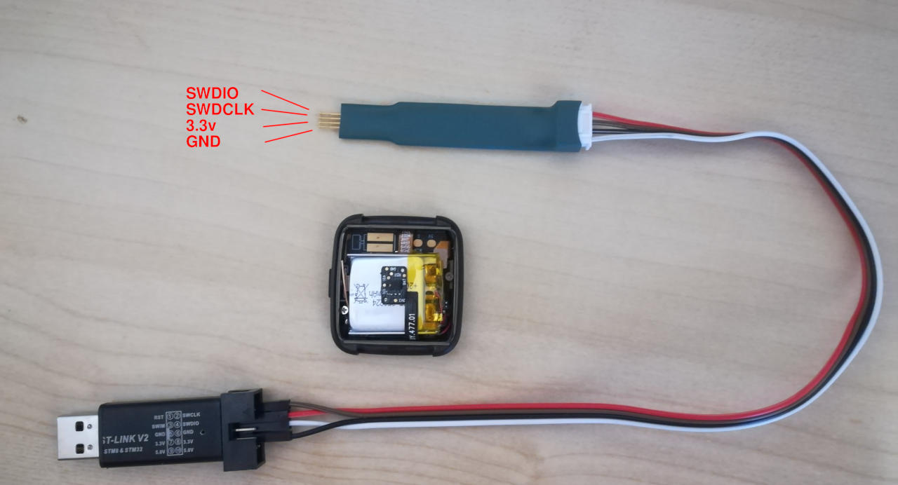
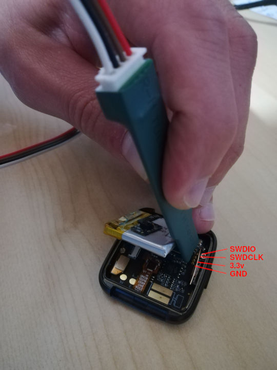

 
First of all, congratulations! I hope you'll have a lot of fun coding, hacking and building projects around the PineTime.

# About the devkit
The first batch of PineTime devkits (end 2019) was preloaded with a demo firmware that implemented most of the functionalities of the watch. It was quite nice, but it was proprietatry, closed source.

Since them, the community worked hard and [many projects have been created](https://wiki.pine64.org/index.php?title=PineTime#Development_efforts), all of them based on different technologies, languages, RTOS and tools.

A few weeks ago, Pine64 asked the community to provide an open source firmware that would be preloaded in the next batch of PineTime devkits, and **[InfiniTime](https://github.com/JF002/Pinetime)** is the chosen one.

The devkit you received is preloaded with InfiniTime [0.7.1](https://github.com/JF002/Pinetime/releases/tag/0.7.1).

Links:

 - [Pine64 PineTime](https://www.pine64.org/pinetime/)
 - [PineTime Wiki](https://wiki.pine64.org/index.php?title=PineTime)
 - [PineTime Forum](https://forum.pine64.org/)
 - [Buy the PineTime devkit](https://store.pine64.org/?product=pinetime-dev-kit)

# About InfiniTime
When I received my PineTime devkit, around October 2019, I was having fun creating my project from scratch, writing low-level drivers...

But the project became really interesting when I met the PineTime community in the chat rooms. This community was created quickly and is composed of developers, hobbyists, enthousiasts and nice people. In these chat rooms, we exchange code, ideas, we show our last achievements, we discuss about the futur of the project,... That's the community that gave me the motivation to continue my work on my project that was called Pinetime-JF at that time.

When other people began to contribute to the project, I decided to rename it **InfiniTime** and to release the code under the terms of the GPLv3 license. This is not *my* project anymore, this is an open source community project!

Now, InfiniTime implements basic functionalities like time synchronization, notifications, music control, and even OTA. OTA allows the user to upgrade the firmare over BLE, and even to install another compatible firmwares!

[The project is available on Github](https://github.com/JF002/Pinetime). The file [Readme.md](https://github.com/JF002/Pinetime/blob/develop/README.md) contains links to the documentation of the project.

# Now, what can I do with the devkit
You can of course use it as a watch, but you'll probably notice that you want more functionalities, or that you want to test another firmware.

## Upgrade InfiniTime or install another compatible firwmare
As of now, InfiniTime 0.7.1 is the latest released version, but 0.8.0 is to be released soon. We have to fix one annoying bug before that happen. Have a look at the [release page on the Github repo](https://github.com/JF002/Pinetime/releases) to see if a newer version is available.

Once a new version is available, you can use NRFConnect on your phone to upgrade the firmware on your watch.

**Note** : I still consider the OTA functionality *experimental*, and something wrong could happen during the upgrade that could brick your watch. I recommand you have a SWD debugger on hands to reflash your device in case the upgrade fails.

It is also possible to install other firmwares that are based on the same bootloader and memory map like [Klok](https://gitlab.com/caspermeijn/klok) and [Hypnos](https://github.com/endian-albin/pinetime-hypnos). Before doing that, please check the state of the project and ensure that OTA is working and that the project allows to OTA to another firmware after the installation is done!

## Connect your SWD debugger and flash your own firmware
The most interesting way to use your PineTime devkit is to actually develop your own firmware. You can decide to contribute to [existing projects](https://wiki.pine64.org/index.php?title=PineTime#Development_efforts) or to start your own.

Connecting the SWD debugger is the tricky part as the connection pads are very small and partially hidden under the battery. There are multiple technics to do so : use single core wires, solder tiny wires, solder a connector, or use the pogo pins that will be available on the Pine64 shop.

I personaly use the JLink debugger that is embedded on my NRF52-DK board, but ST-Linkv2 and Black Magic Probe are known to work very well with the PineTime.

Here is an example using pogo pins and ST-Link V2 :

You can find how other users connect their PineTime on [this forum post](http://forum.pine64.org/showthread.php?tid=8129).

Other interesting links:

 - [PineTime devkit wiring](https://wiki.pine64.org/index.php?title=PineTime_devkit_wiring)
 - [Reprogramming the PineTime](https://wiki.pine64.org/index.php?title=Reprogramming_the_PineTime)

## Contribute to the projects
There are a lot of ways to contribute to InfiniTime or other projects:

 - Add functionalities, fix bugs, improve the code and documentation of existing projects.
 - Develop companion apps for the PineTime that runs on smartphones, computers,...
 - Take pictures and videos of PineTime and talk about it around you and on social networks
 - Suggest your ideas of cool and/or useful applications you would want to see on the PineTime
 - Report bugs and issues you encountered
 - ...

# Join the community
As I said before, the PineTime project has a great community, with very active people, and I enjoy joining them whenever I can!
chat room and forum. If you want to actively develop on your PineTime, or just ask a question or suggest an idea, just join us : 

 - [PineTime forum](https://forum.pine64.org/forumdisplay.php?fid=134)
 - [Matrix Channel](https://app.element.io/#/room/#pinetime:matrix.org)
 - IRC Server: irc.pine64.org Channel: PineTime
 - [Telegram group](https://t.me/pinetime)
 - [Discord server invite](https://discordapp.com/invite/DgB7kzr0)
 
# Need more information?
The [PineTime wiki](https://wiki.pine64.org/index.php?title=PineTime) contains a lot of information about the PineTime, the hardware and the projects.

[@lupyuen](https://lupyuen.github.io/) is an infinite source of information about the PineTime. He wrote a lot of articles and blog posts about the PineTime. You can find all his articles on [his Github profile](https://lupyuen.github.io/).

# Now, it's your turn!
Hack, create, experiment, have fun with your PineTime!

