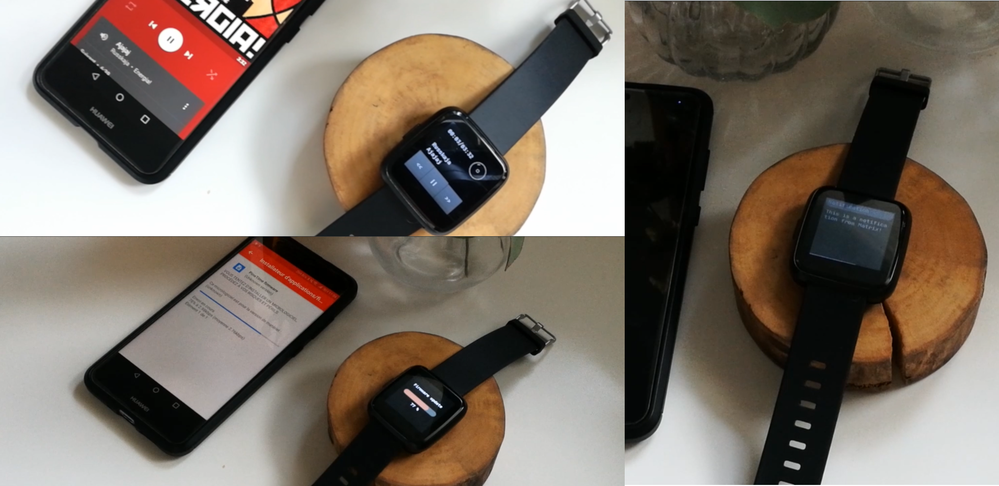

# InfiniTime 0.9.0 

**[Download and release note on Github](https://github.com/JF002/Pinetime/releases/tag/0.9.0)**

This version is certainly the first version that receives the most feedbacks from users and the most contributions from other developers, and I'm very happy that InfiniTime receives that much attention!

As usual, this new version fixes some bugs and brings new features and improvements.

**Two major bugs have been fixed in this release**. The first one prevented the **bootloader** from working correctly after a reset from sleep mode. This would temporarily brick the device, and the only way to revive it was to let the battery drain completely before charging it again. Note that this fix is also present in version 0.8.3.

The driver of the **touch panel** has also been fixed. This issue has been highlighted by the pong game of [ColdBrewCaffin](https://github.com/ColdBrewCaffin) that would freeze InfiniTime. With the help of [TT-392](https://github.com/TT-392), we were able to fix the TWI driver and fix this issue.

The new features, now ! 
First, the **music app** have been greatly improved by [Avamander](https://github.com/Avamander). The UI is really amazing, displays a nice disc animation, uses gestures to switch controls from browsing to volume, and also displays the song progression. Avamander also added support for these new features into [Gadgetbridge 0.48](https://gadgetbridge.org/). Gadgetbridge is a companion app running on Android which provide support for InfiniTime. Note that this version of Gadgetbridge also support **firmware upgrade over the air (OTA)** for Infinitime!

Next, the **notification UI** has been completely re-written. The small modal dialog box that could display only 18 characters has been replaced by a shiny new notification app that displays up to 100 characters.

The **BLE connectivity** has also been improved, it is now easier to connect/reconnect with a smartphone. InfiniTime now exposes the **Battery Information Service** and the **FindMe** profile to BLE host.

Finally, multiple pull-requests that bring improvements to the documentation, code structure and coding guidelines have been merged in this version.

I would like to **thank every one who contributed to this release** by reporting bugs, by contributing to the code and documentation and simply by providing feedback to me and other developers!

