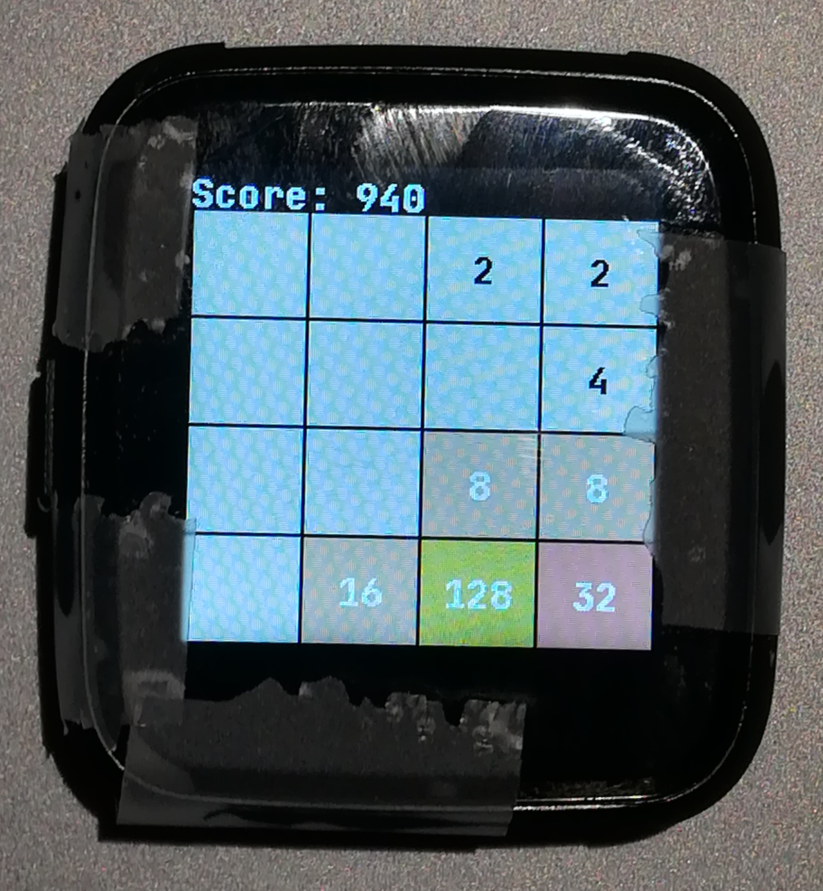

# InfiniTime 0.10.0 

**[Download and release note on Github](https://github.com/JF002/Pinetime/releases/tag/0.10.0)**

I'm very happy to publish this new version of InfiniTime because it contains new features and bugfixes that have been mostly implemented by contributors to the project, not by me !

This version introduces the first 2 games into InfiniTime. The first one is the **Paddle** game from [ZephyLabs](https://github.com/ZephyrLabs), a single player *pong* game. The second one a **2048** clone from [jedmijares](https://github.com/jedmijares/). 

The time needed to turn the display on when pushing on the button has been improved, and the small glitch that displayed the time it was when the display was shut down has been removed, thanks to [IoTPanic](https://github.com/IoTPanic/).

A first step to the internationalization of the firmware has been taken by [AirHamster](https://github.com/AirHamster) who added the support for notifications written in Cyrillic.

The docker image (and the associated documentation) has been greatly improved by [pfeerick](https://github.com/pfeerick/) and [Nuxij](https://github.com/Nuxij/). 

Regarding the code quality, [okaestne](https://github.com/okaestne/) did a nice job by cleaning all the `#include`s of the project, and fixed some build issues and warnings at the same time.

Finally, the bug that would display an erroneous battery level in the app SystemInfo has been fixed by [IoTPanic](https://github.com/IoTPanic/).

