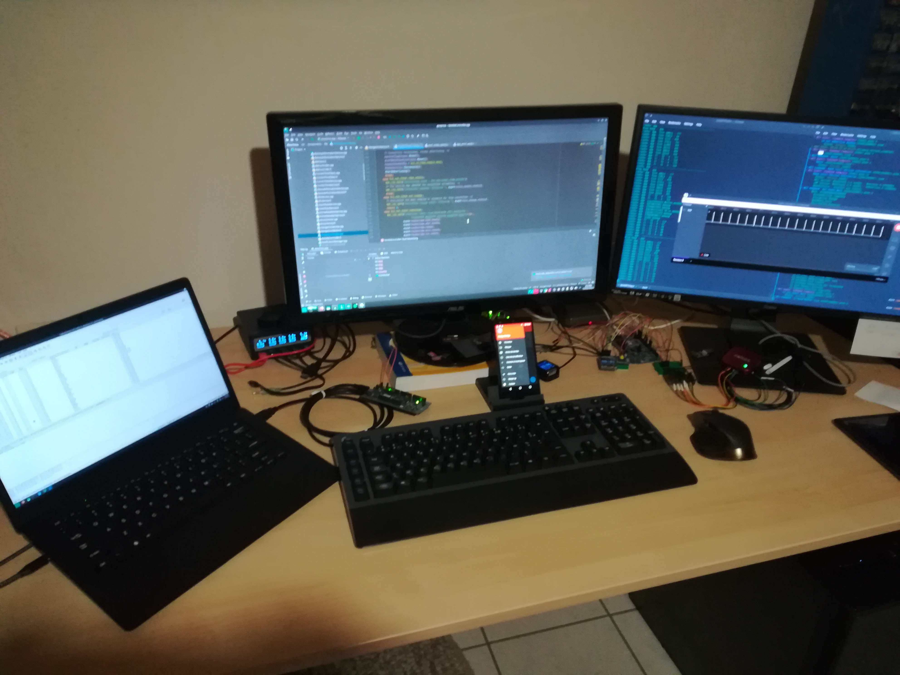
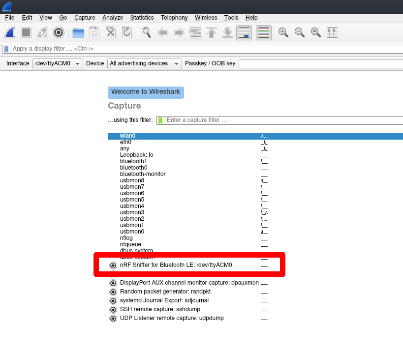
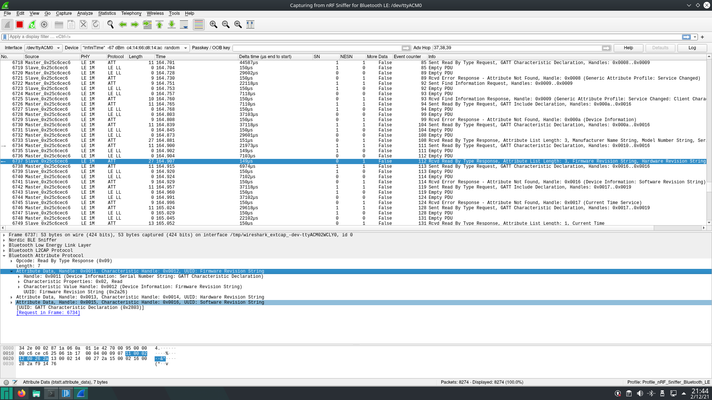
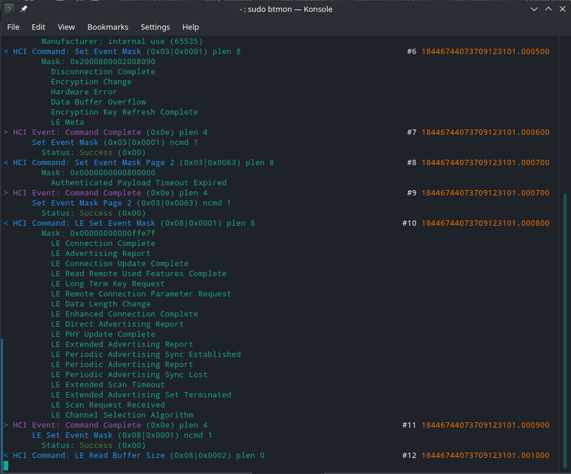
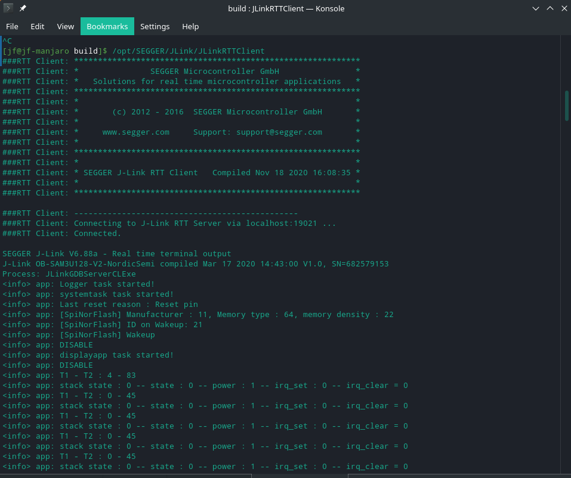
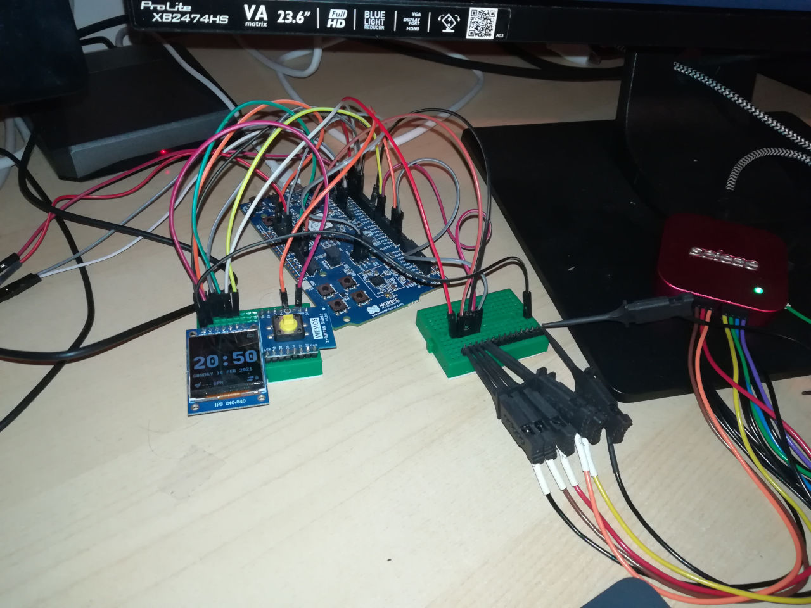
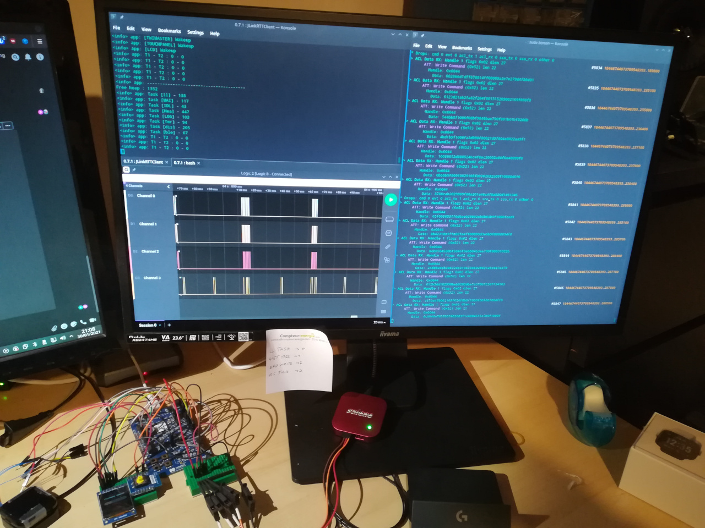

# How to Debug BLE (Bluetooth Low-Energy) connection in InfiniTime and other embedded software ?
These last few days, I've been trying to debug annoying BLE connection issues (impossible to reconnect to the device once it's disconnected, OTA failure,...) in InfiniTime. These issues are really frustrating to analyze because they occur randomly, and I haven't found a way to reproduce them relibably yet.

Even if I still haven't found the cause of these issues, I learned a lot during these investigations, and I think my experience will probably be interesting to other people working on BLE devices!

**NOTE** : Since this document was written, InfiniTime 0.12 and 0.13 were released. These versions brought many improvements in BLE connection reliability.

Note that I'm in no way an expert in RF communication in general and in BLE technologies in particular. 

Before going further, let me warn you: this kind of work might create some mess on your desk!

## Setup your own BLE sniffer
BLE is a RF communication, it happens in the air. It is then relatively easy to listen for all BLE packets passing by between the BLE host and device. Security features and encryption will probably make the understanding of these messages a bit more difficult, but, fortunately, InfiniTime does not implement any security feature (yet).

I don't have such a device but I found out that Nordic Semiconductor (NRF) documents how to create your [own BLE sniffer](https://www.nordicsemi.com/Software-and-tools/Development-Tools/nRF-Sniffer-for-Bluetooth-LE) easily using a [NRF52-DK board](https://www.nordicsemi.com/Software-and-Tools/Development-Kits/nRF52-DK) and [Wireshark](https://www.wireshark.org/)! That's an easy solution for me as I already have a NRF52-DK board on hands. I use it as a devboard for the NRF52832 and also as a JLink debugger for my PineTime devkit.

The installation is [very well documented](https://infocenter.nordicsemi.com/index.jsp?topic=%2Fug_sniffer_ble%2FUG%2Fsniffer_ble%2Fintro.html) on the NRF website : flash the provided firmware and install plugins to your Wireshark insallation so that it can use the NRF52-DK board as a sniffing interface.
 
Once it's installed, you just need to start a new capture using the interface *nRF sniffer for Bluetooth LE*:

You should then be able to see all BLE packets flying around you:

It takes a bit of time to understand and learn the meaning of all these packets, but after a bit of training you'll be able to find read/write accesses to characteristics, advertising packages,...

This tool will be very useful if you need to debug your BLE implementation at the message level, or even understand how other devices communicate with their host.

## See what's happening inside your BLE stack by monitoring the HCI layer
[Btmon](https://manpages.debian.org/testing/bluez/btmon.1.en.html) is a useful tool to monitor what's happening at the HCI level of the BLE stack. The HCI layer (**H**ardware **C**ontroler **I**nterface) is a thin layer that transport commands between the host and the BLE controller. These commands are standardized to allow easier portability accross multiple BLE hardware.

By default, you can use **btmon** to monitor your *bluez* Bluetooth stack running on your Linux computer. 

Nimble (the open source BLE stack used by InfiniTime) needed such a tool to debug the stack and add functionalities. That's why [they decided to implement a monitor mode](https://www.codecoup.pl/blog/support-for-btmon-in-mynewt/) in the library. This mode allows to forward HCI commands over JLink RTT to a btmon instance running on a development computer.

The only constraint of this mode is that it needs a JLink debugger compatible with RTT. Unfortunately, it doesn't work with other SWD debugger like the STLinkV2 and the Black Magic Probe.

To enable this mode, edit the file `src/libs/mynewt-nimble/porting/nimble/include/syscfg/syscfg.h` and set the variables `MYNEWT_VAL_BLE_MONITOR_RTT` and `MYNEWT_VAL_BLE_MONITOR_RTT_BUFFERED` to 1.

Then, connect the JLink debugger on your computer and run the following command:

`btmon -J nrf52 -R "btmonitor"`

Run the modified firmware on your PineTime and you should see something similar to this:

## Logs
InfiniTime generates logs at multiple places of the code, and you can easily add new logs for your own debugging purpose using the macro `NRF_LOG_INFO("Message %d", variable);`

Note that the current logging system in InfiniTime is also based on JLink RTT and only works using a JLink debugger. 

It can be useful to check the value of a variable, check that the code runs as expected, check timings,...

To monitor the logs generated by InfiniTime, you just need to run the `JLinkRTTClient` application from JLink:

## Use a logic analyizer
A logic analyzer is an instrument that captures and displays multiple signals from digital system. It can be used to decode protocols, convert the captured data into timing diagrams...

I have a Saleae Logic 8. It's a nice USB logic analyzer with many functionalities (analog/digital capture, protocol decoder,...) and the companion sofware is really well made, especially the new Logic 2 (which is still in beta, but runs good enough). It allows you to specify triggers, or run the capture in 'infinite' mode, place time markers, easily zoom in/out,... It's a bit pricey, but it totally worth it!

Now, to use it, you need to connect the probes to specific signals of your target: bus RX/TX, control pins... Unfortunately, these pins are not easily available on the PineTime, even on a devkit. That's why I setup my NRF52-DK board (based on exactly the same MCU than the PineTime) : it runs a slightly modified version of InfiniTime and it's connected to the logic analyzer via 4 GPIO pins.

InfiniTime must be slightly modified to disable the usage of the external SPI flash memory, for example, which is not available on the DK board. Other modifications consist in setting/clearing specific GPIO pins at specific points in the code. The logic analyzer monitors the state of these pins.

This allows you to ensure that the application runs specific methods, to measure timings with a high accuracy,...

Here is an example of the logic analyzer monitoring 4 digital signals from my devboard:

That's this specific setup that helped my to find out why the BLE stack would freeze because of incorrect IRQ handling.

