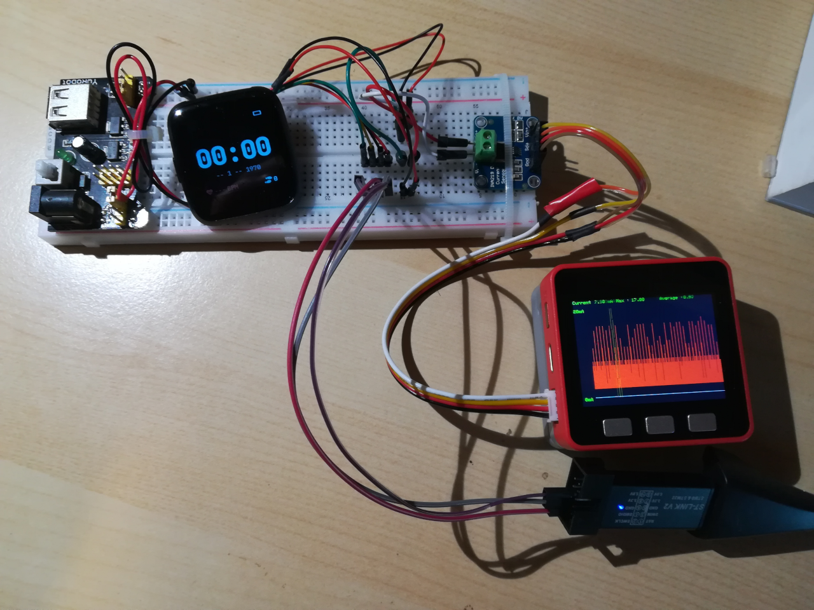
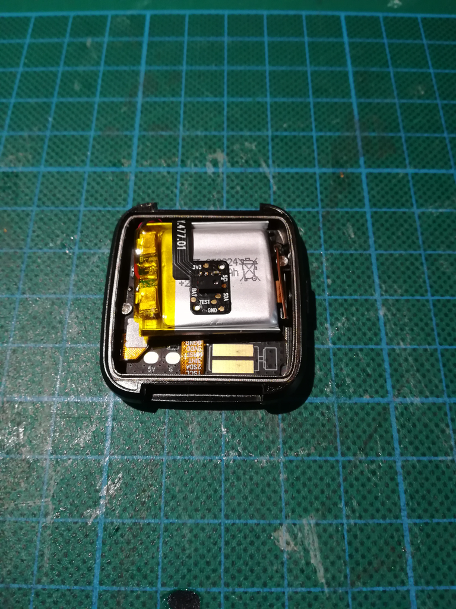
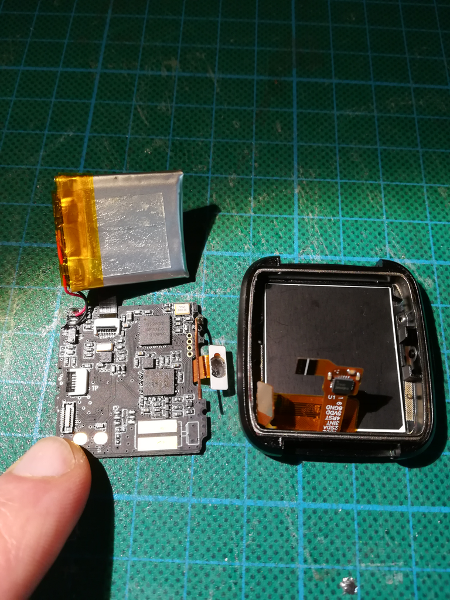
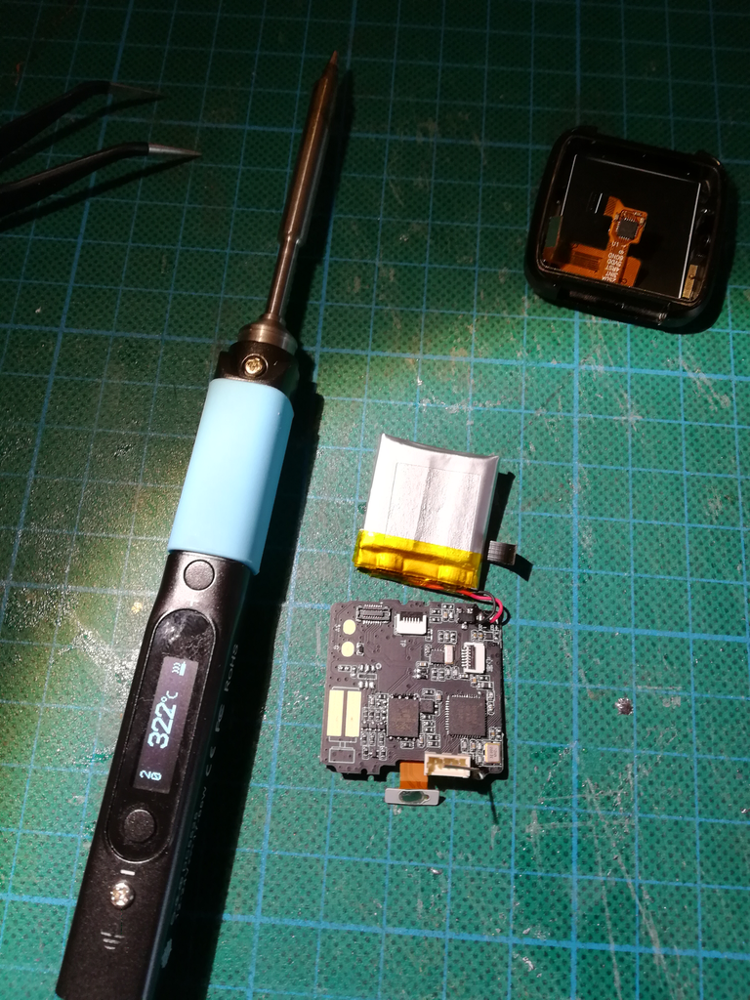
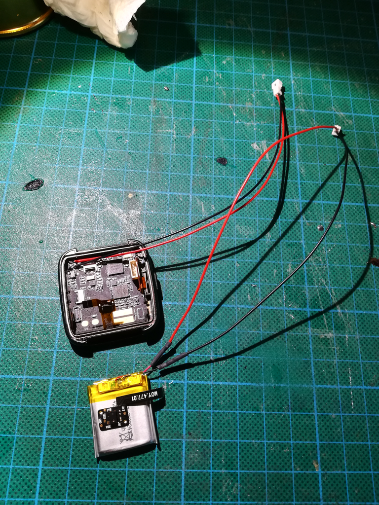
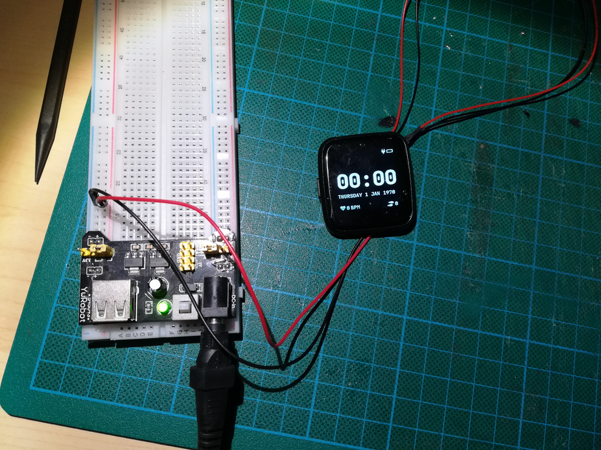
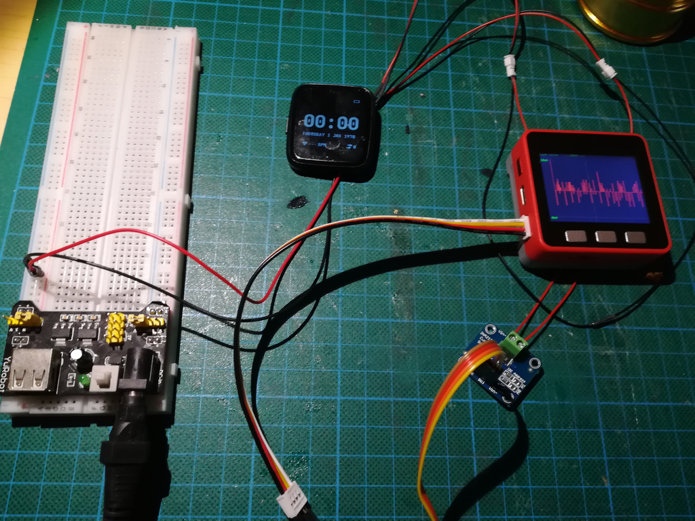

Until now, my PineTime development setup was quite simple : 
 
- A PineTime devkit with wires soldered on the **SWD** pads and some tape to keep the back attached
- A NRF52-DK as the **SWD debugger** (using the embedded JLink debugger)

I also use the NRF52-DK to test specific functionalities, [connect a logic analyzer](https://infinitime.io/blog/2021-02/debug-ble/),...

I've been working on this setup since I'm working on PineTime and InfiniTime, in October 2019!

This setup has some limitations : 

- The wires soldered on the PCB are **very fragile**
- The battery cannot be disconnected to **cut the power** to the MCU and issue a hardware reset
- The **power consumption** cannot be measured

In this article I explain how I, a software engineer with very little knowledge in electronics, built a new dev setup that overcome these limitations!

## The new setup
Before going deeper into details on how I built this new setup, here is a picture of the result:

On the left, you can see the **power supply** that provides 5 volts to the charging pads of the PineTime.

The little board on the right is the **INA219** board. This board can measure the current that flows between its Vin and Vout pins. It's connected to a M5Stack Fire module via an I²C bus. I wrote a simple Arduino app that acquires the values from the ina219 and draws them on the display.

Then, on the bottom is the **STLinkV2 I use to flash/debug the PineTime**.

This setup is well packed, easily movable and less fragile dans the previous one.

## Devkit surgery

Soldering a connector to the SWD pins and adding a connector on the battery wires might seem a very simple task to anyone with electronics, soldering and hardware skills... But to me, it was a very stressful job. Here are the steps I followed.

Here is the **devkit** before any manipulation:

You can see the **PCB**, the **battery** and the **heart rate sensor** on the top. The *BLE antenna* is also visible on the right of the battery. The **SWD** pads are hidden under the antenna.

First, I **disconnected the connectors** and **unmounted the PCB** so that I can easily solder a connector on the SWD pads:

Now, the SWD pads are more visible.

For the next step, I recommend you use a soldering iron with a very small tip. I use the [Pinecil, the soldering iron from Pine64](https://www.pine64.org/pinecil/). On the next picture, you can see I slightly bent the antenna to place the connector on the SWD pad.

Carefully **solder the connector on the back of the PCB**. While you're at it, add a connector on the battery wires (**take care not to short the battery during this step!**) : unsolder the battery, solder a connector on the battery wire and the corresponding connector on the PCB.

You can now **remount** everything, apply power and hope you won't see any magic smoke :)

You can now add **the power measurement tool** on the setup.

Here is the result after a bit of cleaning : 

## How to measure the power consumption?

To measure the current that flows between the battery and the PineTime, I use a [INA219](https://www.best-microcontroller-projects.com/ina219.html) board. This chip is a voltage and current measurement IC that connects to an I²C bus. It's probably not the most accurate way to measure the current, but it's really cheap and easy to use.

The INA219 Vin+ and Vin- must be connected in between the battery and the PineTime, on the red (+) wire.

I wanted to build a standlone tool that I can easily connect to any of my projects. That's why I decided to use the [M5Stack Fire module](https://m5stack.com/products/fire-iot-development-kit) to build my own DIY power monitoring tool. The M5Fire module is based on the ESP32 MCU and provides many devices like a RGB LED, a speaker and and nice LCD display.

The project is a [PlatformIO](https://platformio.org/) project, based on the Arduino framework and uses the following libraries:

- [M5Stack](https://platformio.org/lib/show/1851/M5Stack) : provides driver for the whle M5Fire module (especially the LCD and the buttons)
- [Adafruit INA219](https://platformio.org/lib/show/160/Adafruit%20INA219) : provides a driver for the INA219 chip connected on the I²C bus)

Using these libraries, the code is quite simple : in the `loop()` function, acquire the current measured and draw the values in a graph on the LCD.

I pushed my whole code on [my GitHub profile](https://github.com/JF002/m5_ina219). The implementation is very *quick'n'dirty*, but it's good enough to be actually usable and do some first power measurements on the PineTime running InfiniTime!