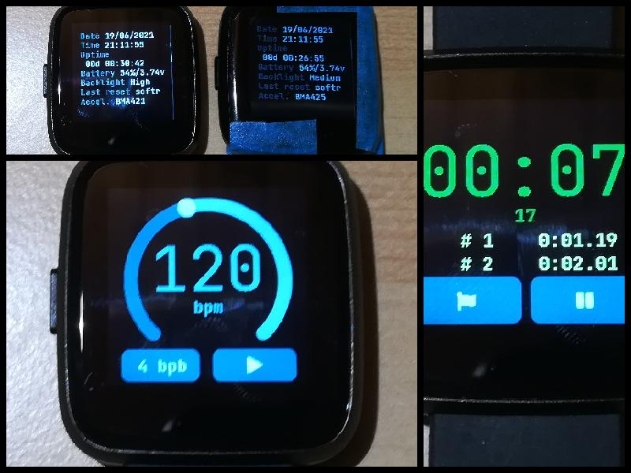

**[Download and release note on Github](https://github.com/JF002/InfiniTime/tree/1.2.0)**

I wasn't planning on releasing InfiniTime 1.2.0 so soon, as many interesting features are in the work right now. But, as we announced in [Pine64 monthly update](https://www.pine64.org/2021/06/15/june-update-new-hardware-and-more-on-the-way/), the factory cannot source the accelerometer (BMA421) anymore. As an alternative, they propose to use the BMA425 instead. This new sensor is very similar (it actually support more built-in features) but needed a few minor modifications to the driver (we need to take into account the new chip ID of the BMA425, for example). As the factory is waiting for a version of InfiniTime that supports the BMA425, I decided to release the version as it is as soon as possible.

So, in addition to the added support for the BMA425, this new version brings 1 new app, many improvements and bugfixes!

The Metronome app was contributed by [Bryton Hall](https://github.com/hall). It uses the vibrator to give the tempo to the user, and provides a nice user interface to select the beats per minute (BPM) and beats per bar (BPB, for creating an accent beat).

The Stopwatch app was also improved by [Riku Isokoski](https://github.com/Riksu9000). It now provides a cleaner user interface.

This release also includes many "behind the scene" developments mostly focused on [memory usage optimizations](https://github.com/JF002/InfiniTime/projects/3). I did [a detailed analysis of RAM and Flash memory usage](https://github.com/JF002/InfiniTime/blob/20a24f8cf56551eae1202f8dc5733bd0cf61adbf/doc/MemoryAnalysis.md) and I've already implemented a few changes that reduce the size of the firmware (from ~420KB to ~340KB) and to reduce the RAM memory usage.

We've also fixed a few bugs (like [this strange memory corruption issue](https://github.com/JF002/InfiniTime/issues/327) on which I spent far more time than expected) and implemented a few improvements and code cleanings.

